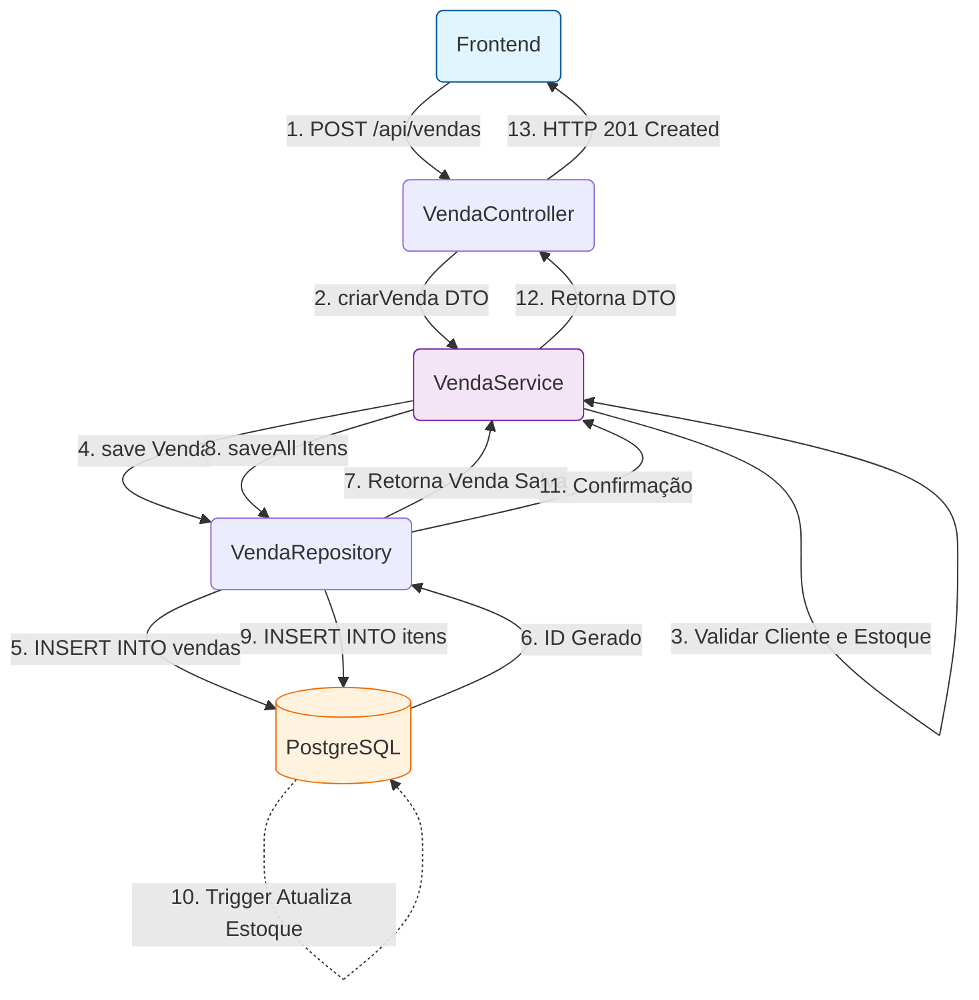
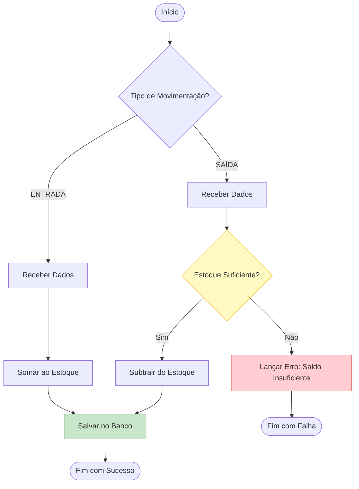
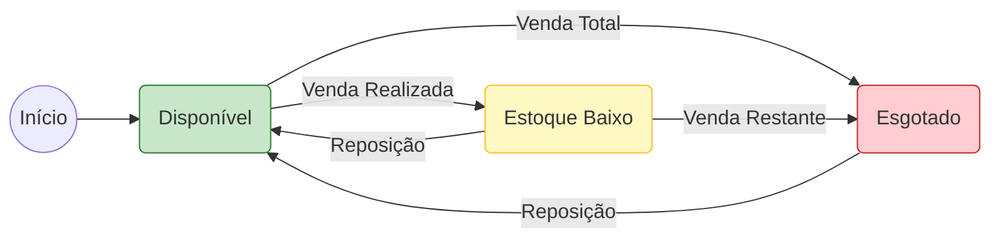
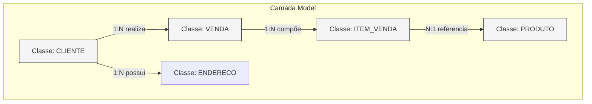

# HortiFlow - Banco de Dados & Engenharia

Documentação de Banco de Dados e Engenharia - HortiFlow
Este documento detalha a modelagem, a estrutura e as regras de negócio implementadas diretamente no banco de dados PostgreSQL do sistema HortiFlow. Esta camada é responsável pela integridade, segurança e performance das transações de estoque e vendas.

---

## 🚀 Configuração Rápida

Para preparar o ambiente de banco de dados, execute os seguintes passos:

1. **Criar o Banco de Dados:**
   ```sql
   CREATE DATABASE hortiflow;

# HortiFlow - Documentação Técnica do Banco de Dados

Documentação detalhada da estrutura, scripts DDL e regras de negócio implementadas no banco de dados PostgreSQL do sistema HortiFlow.

## 📋 Estrutura das Tabelas Principais

Abaixo estão os scripts de criação das tabelas essenciais que sustentam o negócio.

### 1. Produtos
Catálogo de itens com controle de estoque e preços.
```sql
CREATE TABLE public.produtos (
    id bigserial NOT NULL,
    nome varchar(255) NOT NULL,
    preco float8 NOT NULL,
    embalagem varchar(255) NULL,
    estoque_inicial float8 NULL,
    entradas float8 NULL,
    saidas float8 NULL,
    valor_200m numeric(10, 2) NULL, -- Mantido para histórico/compatibilidade
    valor_15m numeric(10, 2) NULL,  -- Mantido para histórico/compatibilidade
    CONSTRAINT produtos_pkey PRIMARY KEY (id)
);
CREATE INDEX idx_produto_nome ON public.produtos USING btree (nome);
2. Clientes
Cadastro de pessoas físicas e jurídicas.

SQL

CREATE TABLE public.clientes (
    id bigserial NOT NULL,
    nome varchar(255) NOT NULL,
    cpf varchar(14) NULL,
    cnpj varchar(255) NULL,
    telefone varchar(255) NULL,
    estado varchar(255) NULL,
    banco varchar(255) NULL,
    cond_pgto varchar(255) NULL,
    ie varchar(255) NULL,
    CONSTRAINT clientes_pkey PRIMARY KEY (id)
);
3. Vendas
Cabeçalho das transações comerciais.

SQL

CREATE TABLE public.vendas (
    id bigserial NOT NULL,
    cliente_id int8 NOT NULL,
    data_venda date DEFAULT CURRENT_DATE NOT NULL,
    valor_total numeric(10, 2) NOT NULL,
    forma_pagamento varchar(50) NOT NULL,
    status varchar(50) DEFAULT 'Concluída' NOT NULL,
    CONSTRAINT vendas_pkey PRIMARY KEY (id),
    CONSTRAINT vendas_valor_total_check CHECK ((valor_total >= (0)::numeric)),
    CONSTRAINT vendas_cliente_id_fkey FOREIGN KEY (cliente_id) REFERENCES public.clientes(id)
);
4. Itens da Venda
Relacionamento N:N entre Vendas e Produtos.

SQL

CREATE TABLE public.itens_venda (
    id bigserial NOT NULL,
    venda_id int8 NOT NULL,
    produto_id int8 NOT NULL,
    quantidade int4 NOT NULL,
    preco_unitario numeric(10, 2) NOT NULL,
    total_item numeric(10, 2) NOT NULL,
    CONSTRAINT itens_venda_pkey PRIMARY KEY (id),
    CONSTRAINT itens_venda_quantidade_check CHECK ((quantidade > 0)),
    CONSTRAINT itens_venda_produto_id_fkey FOREIGN KEY (produto_id) REFERENCES public.produtos(id),
    CONSTRAINT itens_venda_venda_id_fkey FOREIGN KEY (venda_id) REFERENCES public.vendas(id)
);
⚡ Gatilhos (Triggers) e Funções
Automação de regras de negócio diretamente no banco de dados.

1. Baixa Automática de Estoque
Atualiza o saldo do produto ao registrar um item de venda e impede estoque negativo.

Função:

SQL

CREATE OR REPLACE FUNCTION public.fn_baixa_estoque_venda()
RETURNS trigger LANGUAGE plpgsql AS $$
BEGIN
    UPDATE produtos
    SET saidas = saidas + NEW.quantidade
    WHERE id = NEW.produto_id;

    IF (SELECT (estoque_inicial + entradas - saidas) FROM produtos WHERE id = NEW.produto_id) < 0 THEN
        RAISE EXCEPTION 'Estoque insuficiente para o produto ID %', NEW.produto_id;
    END IF;
    RETURN NEW;
END;
$$;
Trigger:

SQL

CREATE TRIGGER tr_baixa_estoque
AFTER INSERT ON public.itens_venda
FOR EACH ROW EXECUTE FUNCTION fn_baixa_estoque_venda();
2. Auditoria de Preços
Registra histórico sempre que o preço de um produto é alterado.

Função:

SQL

CREATE OR REPLACE FUNCTION public.fn_auditoria_preco()
RETURNS trigger LANGUAGE plpgsql AS $$
BEGIN
    IF OLD.preco IS DISTINCT FROM NEW.preco THEN
        INSERT INTO auditoria_produtos (produto_id, preco_antigo, preco_novo)
        VALUES (NEW.id, OLD.preco, NEW.preco);
    END IF;
    RETURN NEW;
END;
$$;
Trigger:

SQL

CREATE TRIGGER tr_auditoria_preco
BEFORE UPDATE ON public.produtos
FOR EACH ROW EXECUTE FUNCTION fn_auditoria_preco();
📊 Visões (Views)
Relatórios pré-compilados para o Dashboard e Análises.

1. Relatório de Vendas Detalhado
Une as tabelas para mostrar quem comprou o quê e quando.

SQL

CREATE OR REPLACE VIEW public.relatorio_vendas_detalhadas AS
SELECT
    v.id AS venda_id,
    v.data_venda,
    c.nome AS nome_cliente,
    p.nome AS nome_produto,
    iv.quantidade,
    iv.total_item,
    v.forma_pagamento
FROM vendas v
    JOIN clientes c ON v.cliente_id = c.id
    JOIN itens_venda iv ON v.id = iv.venda_id
    JOIN produtos p ON iv.produto_id = p.id
ORDER BY v.data_venda DESC;
2. Relatório Financeiro de Estoque
Calcula o saldo atual e o valor monetário total em mercadorias.

SQL

CREATE OR REPLACE VIEW public.relatorio_estoque_atual AS
SELECT
    id,
    nome,
    embalagem,
    estoque_inicial,
    entradas,
    saidas,
    (estoque_inicial + entradas - saidas) AS estoque_atual,
    ((estoque_inicial + entradas - saidas) * preco) AS valor_total_estoque
FROM public.produtos
ORDER BY nome;
```
🛠 Comandos Úteis
Backup do Banco
Bash

pg_dump -U postgres -d hortiflow -F c -b -v -f "backup_hortiflow.sql"
Restore do Banco
Bash

pg_restore -U postgres -d hortiflow -v "backup_hortiflow.sql"


#🏗️ HortiFlow - Engenharia de Software

Documentação técnica da arquitetura, modelagem UML e metodologia de desenvolvimento do sistema HortiFlow.

---

## 📌 Visão Geral

Este documento detalha as decisões de projeto e a modelagem do sistema, servindo como guia para o desenvolvimento e manutenção. A engenharia do **HortiFlow** foi baseada em uma abordagem orientada a objetos e arquitetura em camadas, utilizando a **UML (Unified Modeling Language)** para padronizar a documentação dos requisitos funcionais e do comportamento do sistema.

O objetivo desta documentação é fornecer uma visão clara de *como* o software foi estruturado antes e durante a implementação, garantindo o alinhamento entre as regras de negócio e o código final.

---

## 🛠️ Metodologia e Ferramentas

Para a organização e versionamento do projeto, foram utilizadas as seguintes práticas e ferramentas:

- **Metodologia de Desenvolvimento:** Iterativa e Incremental (focada em entregas por camadas: Backend -> Banco -> Frontend).
- **Modelagem:** UML 2.0 para diagramação estática e dinâmica.
- Modelo caso de uso
 ```mermaid
graph LR
    %% Atores
    Admin((Gerente))
    
    %% Sistema
    subgraph "Sistema HortiFlow"
        UC1(Gerenciar Produtos)
        UC2(Gerenciar Clientes)
        UC3(Registrar Venda)
        UC4(Movimentar Estoque)
        UC5(Visualizar Dashboard)
        UC6(Gerar Relatórios)
    end

    %% Relacionamentos
    Admin --> UC1
    Admin --> UC2
    Admin --> UC3
    Admin --> UC4
    Admin --> UC5

    %% Inclusões e Extensões (Simuladas)
    UC3 -.->|include| UC4
    UC6 -.->|extend| UC5
    
    %% Estilização para parecer Caso de Uso
    style Admin fill:#f9f,stroke:#333,stroke-width:2px
    style UC1 fill:#fff,stroke:#333,stroke-width:1px,rx:20,ry:20
    style UC2 fill:#fff,stroke:#333,stroke-width:1px,rx:20,ry:20
    style UC3 fill:#fff,stroke:#333,stroke-width:1px,rx:20,ry:20
    style UC4 fill:#fff,stroke:#333,stroke-width:1px,rx:20,ry:20
    style UC5 fill:#fff,stroke:#333,stroke-width:1px,rx:20,ry:20
    style UC6 fill:#fff,stroke:#333,stroke-width:1px,rx:20,ry:20
```
Diagrama de Sequência (Fluxo de Venda)

```mermaid
graph TD
    %% Atores e Componentes
    FRONT(Frontend)
    CTRL(VendaController)
    SVC(VendaService)
    REPO(VendaRepository)
    DB[(PostgreSQL)]

    %% Fluxo (Sequência Numérica)
    FRONT -->|1. POST /api/vendas| CTRL
    CTRL -->|2. criarVenda DTO| SVC
    SVC -->|3. Validar Cliente e Estoque| SVC
    SVC -->|4. save Venda| REPO
    REPO -->|5. INSERT INTO vendas| DB
    DB -->|6. ID Gerado| REPO
    REPO -->|7. Retorna Venda Salva| SVC
    SVC -->|8. saveAll Itens| REPO
    REPO -->|9. INSERT INTO itens | DB
    DB -.->|10. Trigger Atualiza Estoque| DB
    REPO -->|11. Confirmação| SVC
    SVC -->|12. Retorna DTO| CTRL
    CTRL -->|13. HTTP 201 Created| FRONT

    %% Estilização
    style FRONT fill:#e1f5fe,stroke:#01579b
    style DB fill:#fff3e0,stroke:#ef6c00
    style SVC fill:#f3e5f5,stroke:#7b1fa2
```
Diagrama de Atividades (Movimentação de Estoque)

```mermaid
graph TD
    INICIO([Início]) --> TIPO{Tipo de Movimentação?}
    
    %% Caminho de Entrada
    TIPO -->|ENTRADA| RECEBE_ENT[Receber Dados]
    RECEBE_ENT --> SOMA[Somar ao Estoque]
    SOMA --> SALVAR[Salvar no Banco]
    
    %% Caminho de Saída
    TIPO -->|SAÍDA| RECEBE_SAI[Receber Dados]
    RECEBE_SAI --> VERIFICA{Estoque Suficiente?}
    
    %% Decisão
    VERIFICA -->|Não| ERRO[Lançar Erro: Saldo Insuficiente]
    ERRO --> FIM_ERRO([Fim com Falha])
    
    VERIFICA -->|Sim| SUBTRAI[Subtrair do Estoque]
    SUBTRAI --> SALVAR
    
    SALVAR --> FIM([Fim com Sucesso])

    %% Estilização
    style VERIFICA fill:#fff9c4,stroke:#fbc02d
    style ERRO fill:#ffcdd2,stroke:#e57373
    style SALVAR fill:#c8e6c9,stroke:#2e7d32
```
Diagrama de Estados (Ciclo de Vida do Produto)

```mermaid
graph LR
    %% Estados
    INICIO((Início))
    DISP(Disponível)
    BAIXO(Estoque Baixo)
    ZERO(Esgotado)

    %% Transições
    INICIO --> DISP
    
    DISP -->|Venda Realizada| BAIXO
    DISP -->|Venda Total| ZERO
    
    BAIXO -->|Reposição| DISP
    BAIXO -->|Venda Restante| ZERO
    
    ZERO -->|Reposição| DISP

    %% Estilização
    style DISP fill:#c8e6c9,stroke:#2e7d32
    style BAIXO fill:#fff9c4,stroke:#fbc02d
    style ZERO fill:#ffcdd2,stroke:#c62828
```
Diagrama de Classes (Estrutura)

```mermaid
graph TD
    %% Classes
    CLIENTE[Classe: CLIENTE]
    VENDA[Classe: VENDA]
    ITEM[Classe: ITEM_VENDA]
    PRODUTO[Classe: PRODUTO]
    ENDERECO[Classe: ENDERECO]

    %% Relacionamentos
    CLIENTE -->|1:N realiza| VENDA
    CLIENTE -->|1:N possui| ENDERECO
    
    VENDA -->|1:N compõe| ITEM
    
    ITEM -->|N:1 referencia| PRODUTO
    
    %% Notas explicativas (opcionais)
    subgraph Camada Model
        CLIENTE
        VENDA
        ITEM
        PRODUTO
        ENDERECO
    end

    %% Estilização
    style CLIENTE fill:#f5f5f5,stroke:#333
    style VENDA fill:#f5f5f5,stroke:#333
    style ITEM fill:#f5f5f5,stroke:#333
    style PRODUTO fill:#f5f5f5,stroke:#333
```

- **Versionamento:** Git e GitHub para controle de código e histórico de alterações.
- **Arquitetura:** MVC (Model-View-Controller) com camadas de Serviço e Repositório.

---


